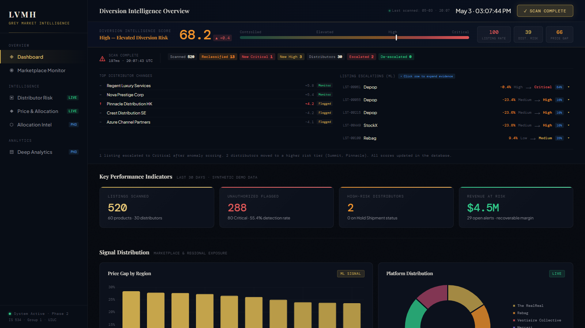
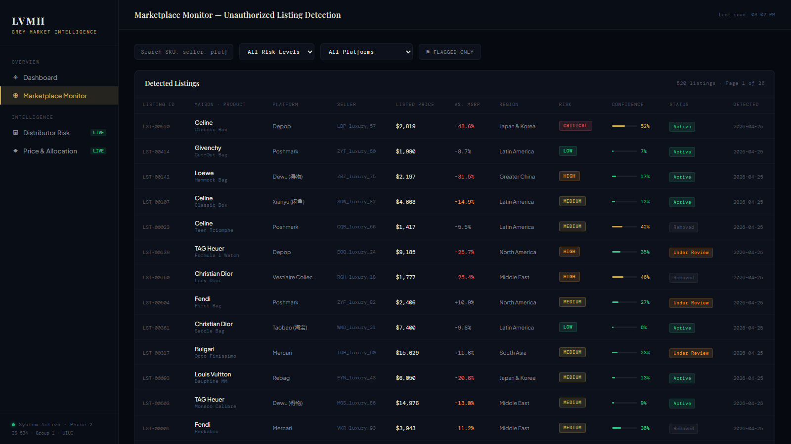
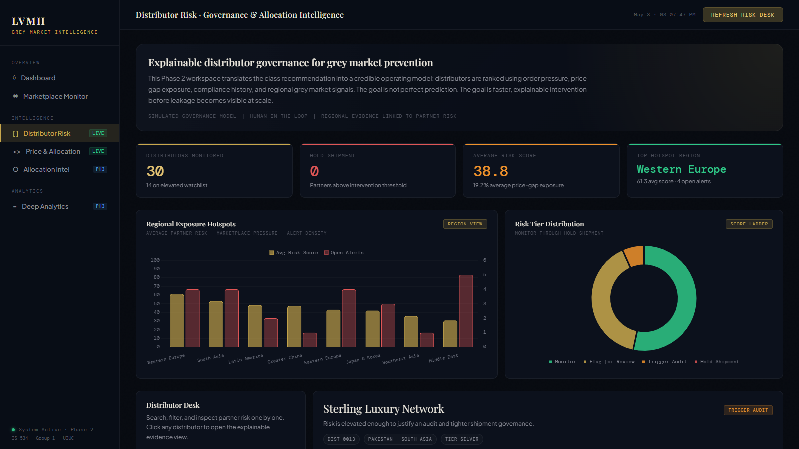
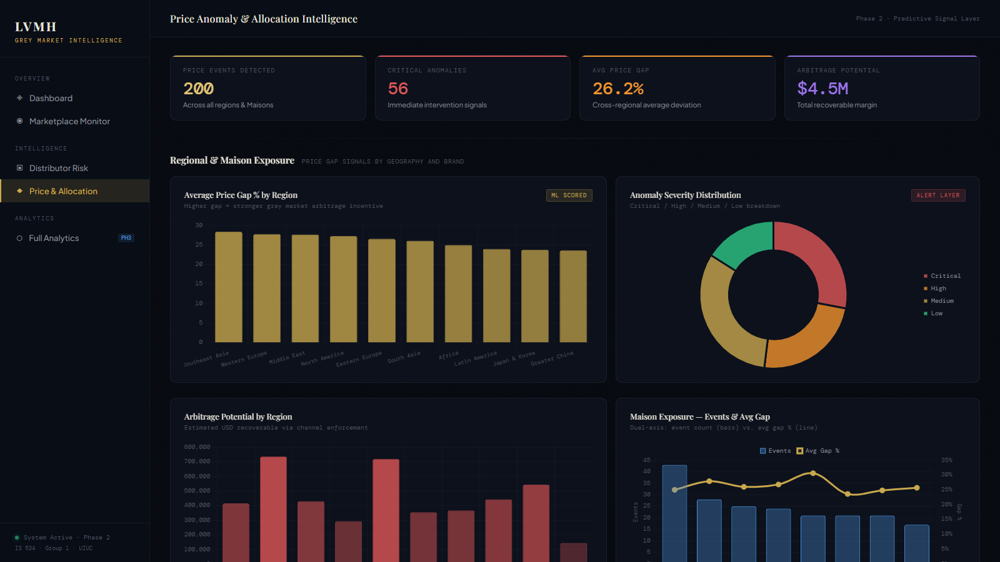
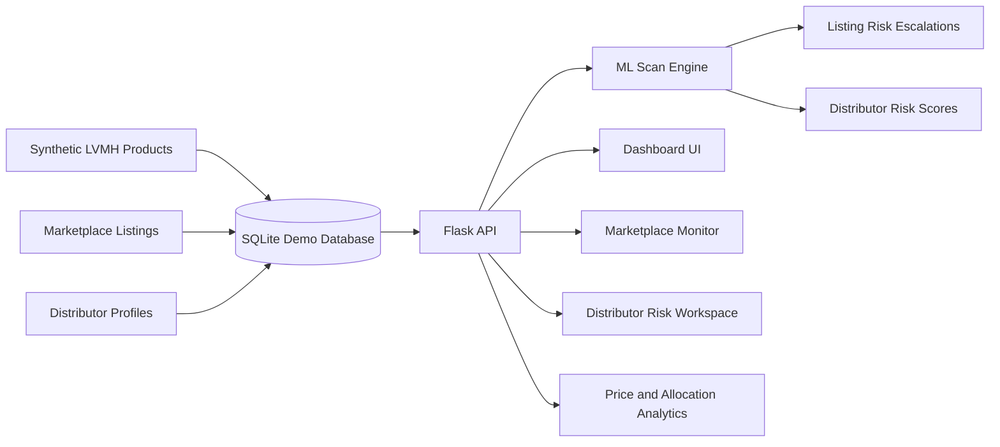

# LVMH Grey Market Intelligence

An AI-assisted grey market diversion intelligence prototype for luxury brand protection, channel governance, and allocation risk monitoring.

This project was built for an information consulting engagement focused on LVMH's grey market challenges. The data is synthetic, but the workflow is real: the app scans marketplace listings, scores distributor risk, explains why records were flagged, and gives leadership an operating view of diversion exposure.

## Live Demo

[Open the live prototype](https://lvmh-grey-market-intelligence.onrender.com)

Render free-tier apps may take a short moment to wake up after inactivity.



## Why This Exists

Luxury maisons face a recurring grey market problem: unauthorized listings, regional price arbitrage, suspicious reseller clusters, and distributor behavior are often monitored in separate systems. This prototype explores what a connected intelligence layer could look like if marketplace monitoring, allocation intelligence, and distributor governance were combined into one explainable AI workflow.

## What It Does

- Scans 520 synthetic marketplace listings across resale platforms and regions.
- Scores listing anomalies using an Isolation Forest model when `scikit-learn` is available, with a deterministic fallback for lightweight demos.
- Calculates a composite distributor risk score from order pressure, price-gap exposure, compliance history, and allocation intensity.
- Shows evidence trails for escalated listings so a reviewer can see why a flag exists.
- Maps seller clusters with a network graph based on shared SKU, platform, and region signals.
- Provides a price and allocation analytics page with regional gap charts, severity distribution, heatmap, and a What-If simulator.
- Seeds a full demo database automatically on first run.

## Prototype Screens

| Marketplace Monitor | Distributor Risk |
| --- | --- |
|  |  |

| Price and Allocation Analytics |
| --- |
|  |

## Architecture



## Tech Stack

- Python
- Flask
- SQLAlchemy
- SQLite
- scikit-learn, optional deploy/runtime model path
- Chart.js
- D3.js
- HTML/CSS/JavaScript
- Render-ready Gunicorn deployment

## Run Locally

Use Python 3.11+ for local development. Python 3.12 is recommended if you want the optional `scikit-learn` path.

```powershell
python -m venv .venv
.\.venv\Scripts\Activate.ps1
python -m pip install -r requirements.txt
python app.py
```

Open:

- `http://127.0.0.1:5000`
- `http://127.0.0.1:5000/listings`
- `http://127.0.0.1:5000/distributors`
- `http://127.0.0.1:5000/analytics`

Optional advanced ML install:

```powershell
python -m pip install -r requirements-phase2.txt
```

## Deploy on Render

This repository includes `render.yaml`, `runtime.txt`, and `requirements-deploy.txt`.

Render setup:

1. Push this project to GitHub.
2. Create a new Render Web Service from the GitHub repo.
3. Choose the free instance type for a portfolio demo.
4. Use the detected Blueprint settings from `render.yaml`, or manually set:

```text
Build Command: pip install -r requirements.txt -r requirements-deploy.txt
Start Command: gunicorn app:app --bind 0.0.0.0:$PORT
```

Free Render services spin down when idle and have an ephemeral filesystem. That is acceptable for this prototype because the app automatically reseeds synthetic demo data when the SQLite database is missing.

## Demo Script

1. Open the dashboard and click `Run Scan`.
2. Show the Diversion Intelligence Score, scan deltas, and listing evidence trails.
3. Open Marketplace Monitor to show listing-level risk, confidence, seller, platform, and status.
4. Open Distributor Risk to explain how partner risk is scored and translated into action.
5. Open Price and Allocation to show regional price gaps and the What-If simulator.

## Project Structure

```text
app.py                         Flask routes and REST API
database.py                    SQLAlchemy models
data_generator.py              Synthetic LVMH-style dataset generation
ml_engine.py                   Listing anomaly and distributor risk scoring
templates/dashboard.html       Executive dashboard and scan workflow
templates/listings.html        Marketplace monitoring table
templates/distributors.html    Distributor risk workspace
templates/analytics.html       Price and allocation analytics
docs/assets/screenshots/       README screenshots
render.yaml                    Render deployment blueprint
requirements.txt               Local app dependencies
requirements-deploy.txt        Deploy-only runtime dependencies
requirements-phase2.txt        Optional advanced ML dependency
```

## Next Build Priorities

- Persist scan history in `scan_runs` and `dis_history` tables.
- Add a portfolio risk trend chart.
- Add one real data connector, starting with a small eBay API proof of concept.
- Add a constrained natural-language query interface over approved database filters.

## Important Note

This is a student prototype with synthetic data. It is not affiliated with LVMH, the University of Illinois, or any marketplace platform.
